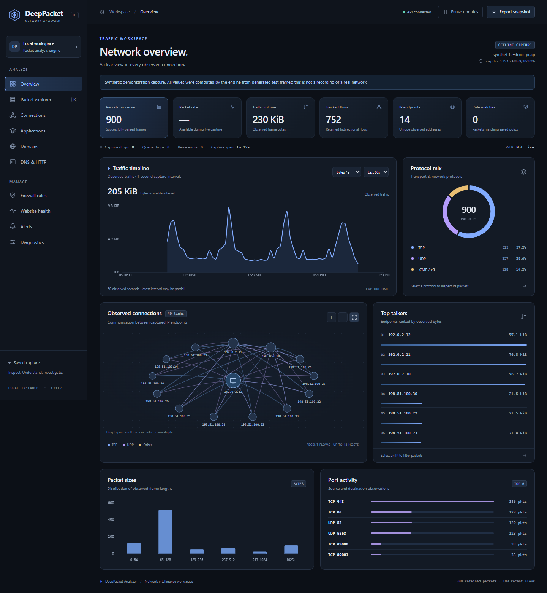

# DeepPacket Analyzer

A real-time C++17 Deep Packet Inspection (DPI) engine for live network traffic capture, classification, and enforcement — paired with an interactive web dashboard.



The screenshot shows measured output from the bundled **synthetic demonstration capture**, not a recording of a real network. The interface and charts work with both offline PCAP analysis and live engine telemetry.

## Try the workspace

After building the engine and running `npm install`:

```powershell
npm run demo
```

Open **http://127.0.0.1:3001**. This processes a deterministic, synthetic PCAP through the real C++ engine and runs the dashboard against isolated files in `artifacts/demo`. It preserves your normal `rules.json` and `output.json`. See [DEMO.md](DEMO.md) for a walkthrough and [docs/TELEMETRY.md](docs/TELEMETRY.md) for the telemetry contract.

The workspace includes:

- A dark overview with a capture timeline, protocol mix, top talkers, packet sizes, and port activity.
- An interactive 2D communication graph derived from recent captured flows. Select an endpoint to filter packets or a connection to inspect its evidence.
- A packet explorer with search, protocol/IP/port/time filters, sortable columns, pagination, and CSV metadata export.
- A keyboard-accessible inspector for frame, Ethernet, IP, TCP/UDP, application evidence, and policy metadata.
- Existing applications, domains, DNS/HTTP observations, rule management, website probes, and alerts in dedicated views.
- Explicit live, stopped, offline, stale, paused-view, empty, and error states. The **Pause updates** control freezes the browser view; capture remains controlled by the engine terminal.

---

## What It Does

- **Live packet capture** via Npcap (Windows) on Ethernet-link-type interfaces
- **Offline PCAP analysis** for pre-recorded captures
- **Traffic inspection**: DNS, HTTP Host, TLS ClientHello (SNI), and basic QUIC v1 Initial detection. QUIC SNI is not extracted.
- **Generic domain detection**: any domain seen in DNS responses is tracked — no hardcoded lists required
- **Connection tracking**: 5-tuple flows with state machine (NEW → ESTABLISHED → CLASSIFIED)
- **Application classification**: maps visible DNS, HTTP Host, and TLS SNI evidence to friendly application names (YouTube, GitHub, Discord, etc.); unfamiliar services remain visible by their raw hostname
- **FastPath**: checks payload and port eligibility before application inspection
- **Rule engine**: match block rules by IP, port, domain (with `*.wildcard.com` support), or application type
- **WFP enforcement** (Windows): installs outbound IPv4 connection filters in protect mode
- **Monitor mode**: captures and classifies traffic without installing any kernel filters
- **Protect mode**: same as monitor but also installs WFP filters when block rules are active
- **Live web dashboard**: real-time throughput, protocol breakdown, top applications, DNS queries, recent connection flows, security alerts
- **Critical website health monitor**: configurable list of websites probed via HTTPS with latency reporting
- **Reference-counted WFP filters**: overlapping domain + IP rules share one kernel filter; filter removed only when last rule is deleted
- **Dynamic rule reload**: edit `rules.json` at runtime — no restart required
- **Fail-safe shutdown**: dynamic WFP session auto-removes all kernel filters on clean exit or crash

---

## Architecture

```text
Npcap / PCAP File
       │
       ▼
 PacketQueue (mutex-protected producer-consumer, 10k capacity)
       │
       ├── Producer Thread (Npcap callback → raw packet)
       │
       └── Consumer Thread
              │
              ├── PacketParser (Ethernet → IP → TCP/UDP → payload)
              ├── FastPath (payload/port eligibility)
              ├── DPI Engine
              │     ├── TLS SNI extractor
              │     ├── QUIC v1 Initial detector (no SNI extraction)
              │     ├── HTTP Host parser
              │     └── DNS parser (query + response + TTL)
              ├── ConnectionTracker
              │     ├── DNS → IP correlation (with TTL expiry)
              │     ├── Application classification
              │     └── Flow recording (last 100 connections)
              ├── RuleManager (IP / port / domain / app rules)
              └── WFP Enforcement (kernel filters, protect mode only)

Telemetry Thread (500ms interval)
       └── output.json (read by Node.js server → dashboard)

Node.js Server (port 3000)
       ├── GET  /data           → live stats
       ├── GET  /rules          → current rules
       ├── POST /rules          → save rule (token required)
       ├── DELETE /rules        → remove rule (token required)
       ├── GET  /health         → critical website probe
       └── GET  /               → dashboard UI
```

---

## Requirements

| Requirement | Notes |
|---|---|
| Windows 10/11 | WFP enforcement is Windows-only |
| [Npcap](https://npcap.com/#download) | Install with "WinPcap API-compatible mode" checked |
| CMake 3.16+ | Build system |
| C++17 compiler | MSVC or MinGW-w64 |
| Node.js 20+ | Dashboard server and tests |
| Administrator | Required for `--protect`; Npcap capture permissions depend on installation |

---

## Build

```powershell
# Configure
cmake -B build -S . -DCMAKE_BUILD_TYPE=Release

# Build
cmake --build build --config Release

# Install Node.js dependencies (first time only)
npm install

# Verify API and offline PCAP pipeline
npm test

# Optional: reproducible synthetic offline throughput baseline
npm run benchmark
npm run benchmark:mixed

# Browser interaction and responsive layout checks (Chrome on Windows)
npm run test:ui

# Optional: five-second monitor-only Npcap check (replace 7 with your interface index)
npm run smoke:live -- 7
```

The automated tests generate PCAPs and exercise HTTP Host, TLS SNI, DNS, IPv6, fragments, link types, compact rule JSON, filtered-PCAP replay, API access, health-check concurrency, and bounded analytics. Browser tests use engine-generated fixture telemetry and cover charts, filters, inspection, export, rules, status transitions, and responsive layouts. The live smoke command runs in an isolated monitor-mode workspace and verifies capture plus rule reload acknowledgment.

Scripts find the engine in `build`, `build/Release`, or `build/Debug`. Set `DPA_ENGINE_PATH` if your executable is elsewhere. Browser tests use installed Chrome on Windows; on other systems run `npx playwright install chromium` first. `DPA_BROWSER` can select another installed Playwright browser channel.

---

## Run

### 1. List network interfaces
```powershell
.\build\PacketInspector.exe --list-interfaces
```

### 2. Start the web dashboard server
```powershell
npm start
```
Open **http://127.0.0.1:3000** in your browser. The server prints a rule management token in its terminal; enter it when the dashboard asks before changing rules. Set `DPA_RULE_TOKEN` before starting the server if you need a stable token.

### 3. Monitor mode (no WFP, no elevation required for Npcap-permitted users)
```powershell
.\build\PacketInspector.exe --interface 6
```

### 4. Protect mode (WFP enforcement active — requires Administrator)
```powershell
# Run PowerShell as Administrator
.\build\PacketInspector.exe --interface 6 --protect
```

### 5. Offline PCAP analysis
```powershell
.\build\PacketInspector.exe --pcap capture.pcap output_filtered.pcap
```

---

## Operating Modes

| Flag | WFP | Effect |
|---|---|---|
| `--interface <id>` | OFF | Monitor only — classifies and logs traffic, installs no kernel filters |
| `--interface <id> --protect` | ON | Monitor + enforcement — block rules take effect as real kernel WFP filters |

> **Note:** Already-established TCP connections are not retroactively dropped when a block rule is added. The block applies to **new** connection attempts only. To fully block an active connection, close the browser tab and ensure a new connection is initiated after the rule is in place.

---

## Block Rules (via REST API or rules.json)

```powershell
$env:DPA_RULE_TOKEN = 'choose-a-private-token'
npm start

# In another PowerShell terminal:
$body = @{ type = 'domain'; value = '*.example.com' } | ConvertTo-Json
Invoke-RestMethod http://127.0.0.1:3000/rules -Method Post -ContentType 'application/json' -Headers @{ 'x-rule-token' = 'choose-a-private-token' } -Body $body
```

The API response confirms that the rule was **saved**, not that Windows denied a connection. The engine reloads rules when running. Monitor mode only records rule matches; protect mode also installs WFP filters for supported outbound IPv4 rules. The dashboard's WFP badge reports whether that engine is active, not a per-flow denial receipt.

---

## Critical Website Health Monitor

Configure `critical_websites.json` to list websites to probe:

```json
{
  "websites": [
    { "name": "GitHub", "category": "development", "domains": ["github.com"] },
    { "name": "Coursera", "category": "education", "domains": ["coursera.org"] }
  ]
}
```

Results available at `GET /health`.

---

## Configuration Files

| File | Purpose | Committed |
|---|---|---|
| `rules.json` | Persisted block rules (IP, domain, port, app) | Yes (default empty) |
| `critical_websites.json` | Sites to health-probe | Yes |
| `output.json` | Runtime telemetry output (gitignored) | No |

---

## Telemetry Output

While running, `output.json` is written every 500ms and includes:

```json
{
  "schema_version": 1,
  "generated_at": "2026-09-28T12:00:00Z",
  "engine_state": "running",
  "packets": 21189,
  "processing_drops": 0,
  "max_queue_depth": 388,
  "packets_pushed": 21189,
  "packets_popped": 21189,
  "mode": "live",
  "protection_requested": false,
  "applications": { "GitHub": 23, "YouTube": 4, "Discord": 8 },
  "domains": { "github.com": 23, "youtube.com": 4 },
  "flows": [],
  "wfp": { "active": false, "status": "NOT INITIALIZED", "ip_filters": 0 }
}
```

The JSON above is an abbreviated schema example, not measured output. New snapshots also include `session_id`, `parse_errors`, and an additive `analysis` object containing bounded packet metadata and measured aggregates. See [docs/TELEMETRY.md](docs/TELEMETRY.md) for fields, units, and retention limits.

`GET /data` adds a `status` field: `live`, `stale`, `offline`, or `unavailable`. Final snapshots have `engine_state: "stopped"`. The browser uses millisecond-resolution `generated_at` for live rate deltas; its timeline uses timestamps from captured frames, so completed PCAPs also have a meaningful timeline.

Chart.js is installed at a locked version and served locally. No CDN, web font, or external asset request is needed to render the dashboard. Website probes run when the health view is opened.

---

## Known Limitations

- **WFP requires Administrator**: if WFP cannot initialize, the engine reports an error and continues without enforcement. Check `wfp.status` in `output.json`. Elevated enforcement was not verified in the current non-elevated test session.
- **Established connections**: block rules apply only to new connections. Existing TCP sessions are not terminated.
- **Domain→IP mapping depends on DNS observation**: if a DNS response for a domain was not captured before a block rule was added, the IP filter cannot be installed until the next DNS resolution is observed.
- **DNS TTL expiry**: cached IP→domain mappings expire per DNS TTL. After expiry, connections revert to IP-only classification until the next DNS resolution is observed.
- **QUIC**: the engine identifies some QUIC v1 Initial packets but does not extract SNI from protected QUIC payloads.
- **IPv6**: full IPv6 addresses are retained in flow keys, but only common extension headers are parsed; WFP V6 enforcement is not implemented yet.
- **Capture link type**: only Ethernet (`DLT_EN10MB`) is accepted. Other PCAP and interface link types fail explicitly until their framing is implemented.
- **Encrypted names**: TLS Encrypted Client Hello and encrypted DNS can hide names from passive observation.
- **Bounded telemetry**: only the latest 300 parsed packet records and 100 recorded flows are sent to the browser. The timeline retains up to the latest 300 capture seconds. Endpoint and port aggregates track up to 4,096 keys each and report truncation; the tracker retains at most 10,000 flows and 16,384 DNS mappings. Full PCAP remains the source for older packet details.
- **Inspection depth**: the dashboard exports metadata, not packet payload bytes. TCP stream reassembly, QUIC SNI, PCAPNG, and complete VLAN/extension-header handling are not implemented.
- **Graph scope**: the communication graph shows up to 18 endpoints and 40 flow links from the recent flow window. It is not a physical network topology or an inventory of all hosts.
- **Measurement limits**: synthetic fixtures test correctness and bounded retention; they are not a classification accuracy study or evidence of production-scale capacity.
- **Windows only**: WFP enforcement is Windows-specific. The capture engine (Npcap/libpcap) and DPI pipeline work cross-platform, but WFP code is `#ifdef _WIN32` guarded.

---

## Windows Setup

See [WINDOWS_SETUP.md](WINDOWS_SETUP.md) for Windows prerequisites, build commands, operating modes, and troubleshooting.

See [BENCHMARK.md](BENCHMARK.md) for the reproducible synthetic offline throughput baseline and its limits.
